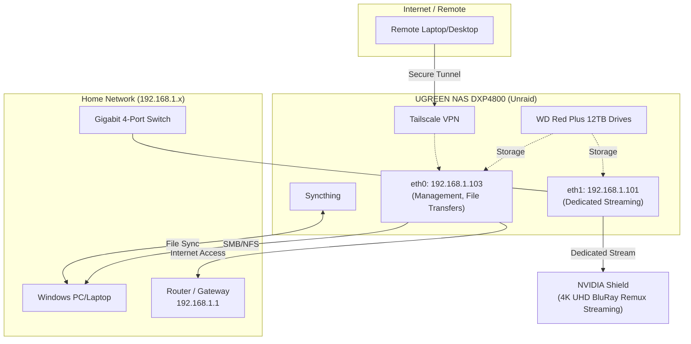

# 4k UHD Remux-capabel Home "Netflix" with Remote File Syncing (Unraid NAS, NVIDIA Shield Streaming with Dedicated NIC)
This lets me stream 4k UHD BluRay Remuxs (>100 Mbps bit rate) smoothly with no interference with the rest of the home network.

With 4 docker containers also running on the NAS, downloads from usenet can be fully autmated from a command from my phone and will be renamed and organized into the media library. And some personal files can be synchronized securely to my laptop over the internet via `tailscale` and `synthing`. 

Via custom networking configs I can dedicate one of the NAS NICs solely to streaming to the home theater, so these super-high bitrate remuxes can play with no lag, while other network traffic happens separately (e.g. downloads and syncing).

Unraid's model is much more flexible than traditional RAID while still offering disk redundancy.

Hardware
* UGREEN NAS DXP4800 (2x gigabit NICs)
* WD Red Plus 12TB Drives
* Gigabit 4 port switch
* Streaming client: NVIDIA Shield

## Initial NAS/Unraid Setup
1. A 128GB USB Stick wouldn't work. The Unraid Creator corrupted it. I had to use a 32GB
2. Update BIOS to disable Watchdog and set USB as only boot device (block UGREEN OS)
3. Setup 2-disk Array. You have to choose "3" as it's the minimum but leave one empty (for now)
4. Run initial Parity

## Optimize/Fix Cooling
Without these steps the drives were running up to 50C during parity check

1. Install Community Apps
2. Install `IT87` Drivers App/Plugin (required to access the Fan PWM Controllers)
3. Install `FanCtrl Plus` App
4. Create fan control profiles/curves for each PWM controller, making sure to use the drive temps for pwm controller 3 (rear fan in my case). Use their fan start test to identify fans.

## Networking - Basics
1. Configure eth0
    * Static IP (.103 /24)
    * Default gateway (e.g. 192.168.1.1)
    * This will be used for network file transfers, internet access, management, etc...
3. Configure eth1
    * Static IP (.101 /24)
    * No gateway
    * This will only be used for streaming

## Networking - Setup Policy Based Routing
If we leave it just as above, Linux will use Asymmetrical Routing by default. So even though we access the shares at .101 (eth1),
Linux will reply using eth0 (I think because it has a gateway), which we don't want.

Update the `/boot/config/go` script to include what's in the file next to this one (`unraid_startup_go.sh`).

Apply run it (except the last statement) directly via ssh first to test.

## Import (large volumes of) existing data via locally attached external drives 

### Install tmux
Install the tmux App (Tmux Terminal Manager (TTM)). This is useful for copying large files from locally attached devices via ssh (connecting from another machine) without worrying about that session being disconnected and stopping the transfer.

### Importing old data
1. Connect existing drive via USB
2. Install Community Apps plugin
3. Install Unassigned Devices App
4. Mount USB drive
5. ssh to Unraid from another device (eg `ssh root@192.168.1.103`)
6. Open a `tmux` session
    1. From within it, run your copies with rsync, e.g.  
    `rsync -rtP --info=progress2 /mnt/disks/ExternalUSB/SourceDir /mnt/user/NewShareName/`
    2. Detach from tmux if you want `Ctrl+B, d`, then exit ssh
    3. Reattach with `tmux ls`, `tmux attach-session -t 0`

## Setup Shares
In both cases I had to setup user-based auth. I couldn't get anonymous/guest to work.

I also set the user setup there (to access the share) matched the username of the user I access it from on Windows (thought not usre really necessary).

Make sure to access shares (to copy files) via the non-streaming IP (.103)

* Setup SMB Shares (to access from Windows)

* Setup NFS Shares (to access from Shield)

## Configure Shield client
I use `Kodi` as a client. It has as nice UI for your movie catalog and can handle the huge remuxes better than Plex.

Configure your libraries, pointing them via NFS to the NAS on `eth1`. NFS will perform better than SMB.
  * Note the path I access them from the Shield was a little confusing

## Setup file syncing
I use this for synchronizing Ableton projects from my home PC to my laptop.

On Unraid Server (make sure Docker service is enabled)
1. Setup a new file share for `ableton-projects` 
2. Under Apps, install `binhex-syncthing`
    * Point it to the ableton share
On Laptop and Desktop
3. Install [syncthing trayzor](https://github.com/GermanCoding/SyncTrayzor) on Windows laptop and Desktop PC
For Remote Connections
4. Setup Tailscale on Laptop and Server